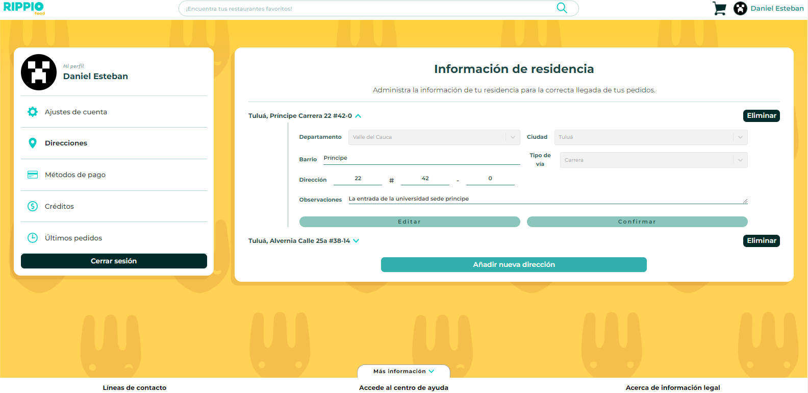
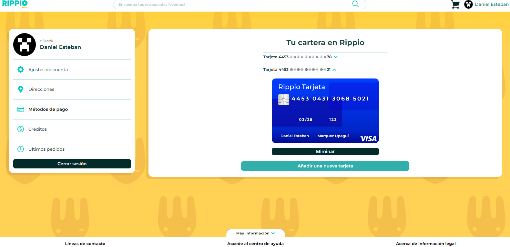
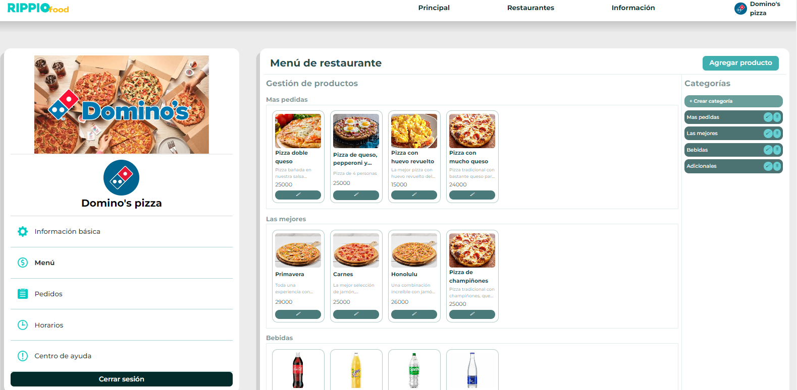
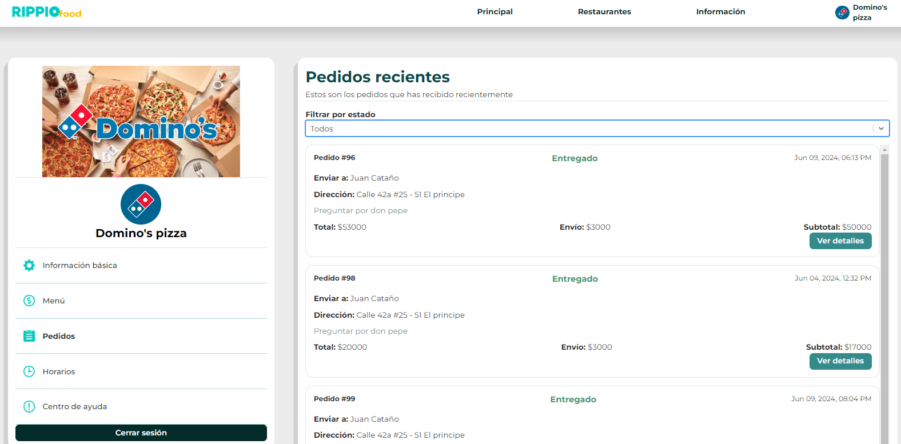
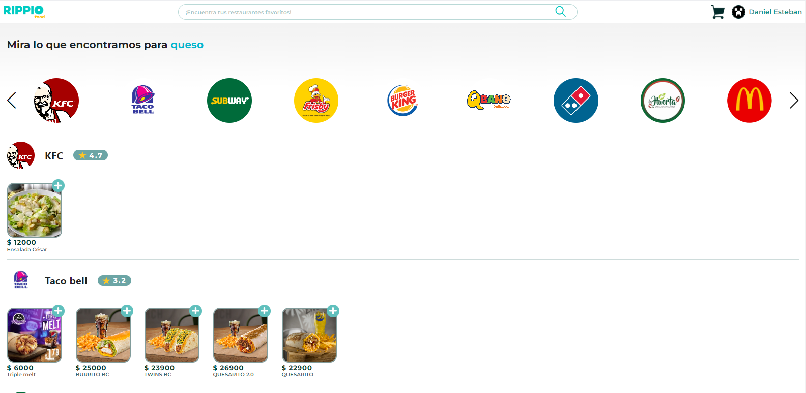
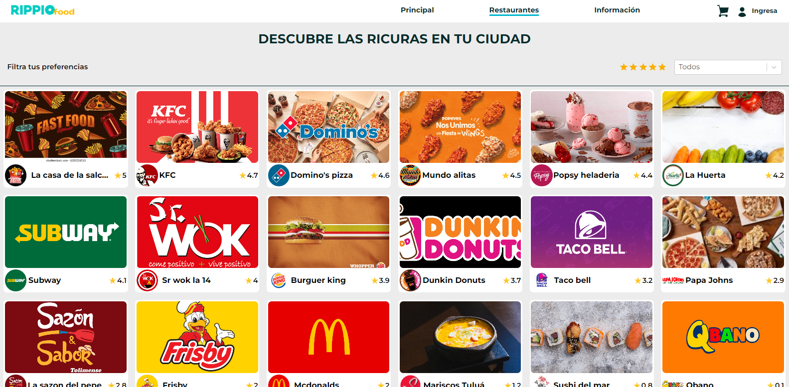
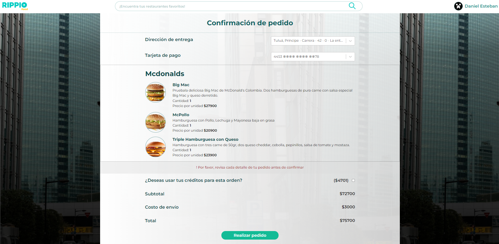

# Rippio
Rippio is being developed to be a web application that connects people with restaurants. Your favorite foods in one place.

# Website
[Visit Rippio](https://rippio.netlify.app/)

# How it Works
Rippio includes two methods of use: as a client or as a restaurant. Both can create an account, sign in, and change their password if forgotten.

## As a Client
- **Manage Profile:** Upload a profile photo, update your information, payment methods, and address.
- **View Orders and Credits:** Keep track of your orders and credits.
- **Use the Cart:** Add products to the cart, which can be used without an account and will be saved for your next session. Proceed to pay when ready.
- **Make Orders:** When you pay, you create an order, allowing you to see the order details and generate credits. (Note: Payments are not real, but you must add a real credit card, which can be generated from a website generator).
- **Purchase Plans:** Buy various plans to enhance your experience and receive additional benefits.

## As a Restaurant
- **Select Categories:** Manage your restaurant's categories, number, address, and schedule.
- **Create a Menu:** Set up sections and products for your menu.
- **Manage Orders:** Easily manage orders by selecting a status (e.g., pending, in progress, canceled). View user details and order specifics.
- **Change Profile Icon and Banner:** Update your restaurant's profile icon and banner to reflect your brand.

# Parts of the Application

## Search Section
Search for restaurants or specific dishes easily using the search feature.

## All Restaurants Section
Browse through a comprehensive list of all available restaurants. View restaurant details, ratings, and available dishes before making your choice.

## Checkout Section
Complete your purchase.

